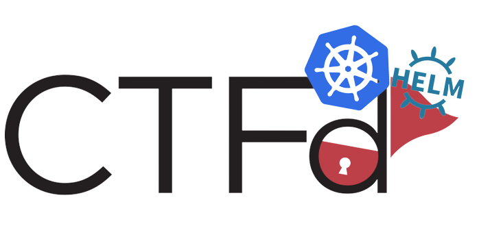

[](https://github.com/BenjiTrapp/CTFd-helm-chart/actions/workflows/blank.yml)

<br/>
<div id="ctfd-logo" align="center">
    <br />
    
    <h3>A Helm Chart for CTFd</h3>
</div>
<br>

### What is CTFd?
CTFd is a Capture The Flag framework focusing on ease of use and customizability. It comes with everything you need to run a CTF and it's easy to customize with plugins and themes.

### Let's get started
##### Prerequisites: oc client, helm, a k8s/OpenShift cluster (or KinD/k3s/minikube)

To get started, simply adjust the values in the `values.yaml`. All required fields are marked. Use the upcoming snippet to render the helm chart and apply it to the cluster:

```bash
helm template . | tee snitch.yaml | oc apply -f -
```
